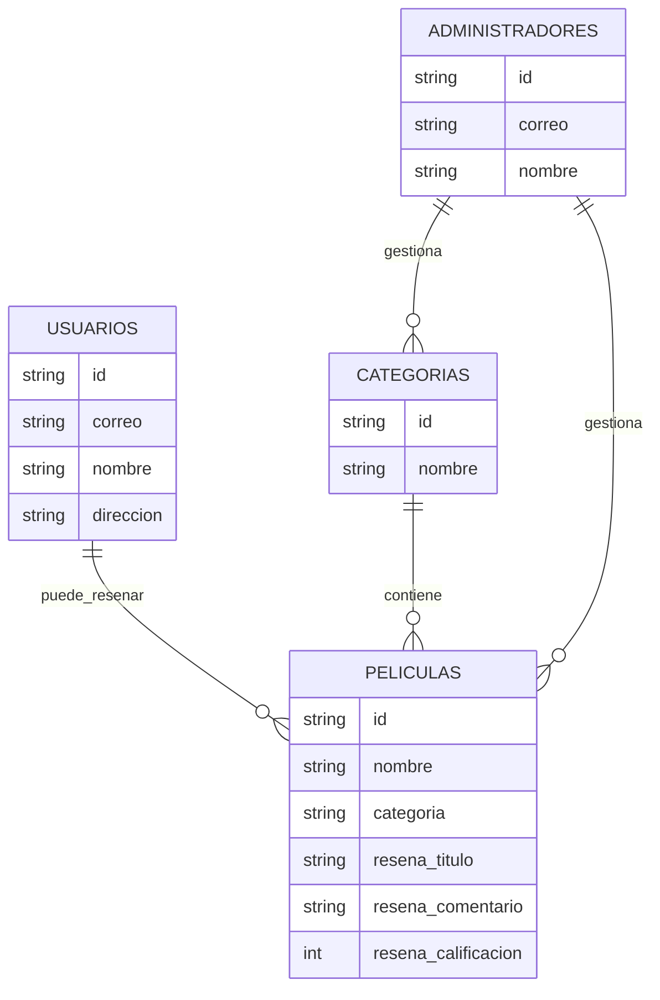

<h3 align="center";>
<b>KarenFlix</b>
</h3>

<br>
<br>
<br>

<h3 align="center";>

**Juan Santoyo**

</h3>

<h3 align="center";>

**Vladimir Diaz**

</h3>

<br>
<br>
<br>
<br>

<h3 align="center";>

**S1**

</h3>

<h3 align="center";>

**Pedro Felipe Gómez Bonilla**

</h3>

<br>
<br>
<br>
<br>

<h3 align="center";>

**CAMPUSLANDS**

</h3>

<h3 align="center";>

**RUTA NODE**

</h3>

<h3 align="center";>

**BUCARAMANGA, SANTANDER**

</h3>

<h3 align="center";>

**2025**

</h3>

---
# KarenFlix

## Objetivo

El objetivo de este proyecto es desarrollar una aplicación full-stack usando **Node.js** + **Express** para el backend y **HTML** + **CSS** puro para el frontend, que permita a los usuarios registrar, calificar y rankear películas, animes y series geek. Esta herramienta debe incluir funcionalidades para gestionar usuarios, reseñas, categorías y rankings, diferenciando permisos de usuario y administrador. Además, debe contar con autenticación segura, validaciones robustas y un frontend que consuma la API desarrollada.

## Funcionalidades Requeridas

### Gestión de Usuarios

- **Registro de Usuarios:** Los nuevos usuarios deben poder registrarse en la aplicación.
- **Autenticación:** El sistema debe permitir el inicio de sesión para acceder a funcionalidades protegidas.
- **Perfiles de Usuario:** Cada usuario debe tener un perfil para gestionar sus reseñas y datos.

### Catálogo de Contenido

- **Gestión de Películas/Animes/Series:** CRUD completo para administradores.
- **Búsqueda y Filtros:** Funcionalidades para buscar contenido por título, categoría, año, etc.
- **Clasificación por Categorías:** Las películas deben estar organizadas en categorías (ciencia ficción, terror, etc.).

### Sistema de Calificación y Reseñas

- **Creación de Reseñas:** Los usuarios autenticados deben poder escribir reseñas y calificar contenido.
- **Valoración:** Los usuarios deben poder calificar el contenido con un sistema de puntuación.
- **Comentarios:** Un sistema para que los usuarios puedan comentar en las reseñas.

### Rankings

- **Generación Automática:** Crear rankings basados en las calificaciones de los usuarios.
- **Visualización:** Mostrar los rankings por categoría o globalmente.

### Seguridad y Permisos

- **Roles de Usuario:** El sistema debe distinguir entre usuarios normales y administradores, con permisos de acceso diferenciados.
- **Autenticación y Autorización:** Usar tokens JWT para proteger las rutas del API.

## Consideraciones Técnicas

### Backend

- **Desarrollado en Node.js** con **Express**.

### Autenticación

- JWT con **passport-jwt**, **jsonwebtoken** y **bcrypt** para la gestión segura de contraseñas.

### Variables de Entorno

- Uso de **dotenv**.

### Control de Peticiones

- **express-rate-limit** para evitar abusos.

### Validaciones

- **express-validator** para validar los datos en los endpoints.

### Base de Datos

- **MongoDB** utilizando el driver oficial.

### Documentación de API

- **swagger-ui-express**.

### Frontend

- **HTML**, **CSS** y **JavaScript** puro.

### Arquitectura

- Organización del código en directorios como `/models`, `/controllers`, `/routes`, etc.

---

## 📚 Caso de Estudio: KarenFlix

### 1. Contexto
El entretenimiento digital es una de las industrias con mayor crecimiento en los últimos años. Plataformas como Netflix, Crunchyroll y Disney+ dominan el mercado del streaming, ofreciendo a los usuarios una amplia variedad de películas, series y animes. Sin embargo, la mayoría de estas plataformas carecen de herramientas abiertas que permitan a los usuarios **gestionar sus propias reseñas, rankings personalizados y comentarios comunitarios** en un solo lugar.

**KarenFlix** nace como una propuesta académica dentro de la **Ruta Node en Campuslands**, con el objetivo de crear una aplicación full-stack que combine la **gestión de contenidos** con la **interacción del usuario**, asegurando autenticación segura, permisos diferenciados y un frontend funcional.

---

### 2. Problema
Actualmente, los usuarios que desean:
- Calificar películas, series y animes,
- Escribir reseñas y compartir opiniones,
- Consultar rankings personalizados,

deben usar múltiples plataformas o redes sociales sin una integración centralizada.  
Esto **fragmenta la experiencia** y **limita la visibilidad de las opiniones** en un solo ecosistema.

---

### 3. Objetivo del Proyecto
Diseñar y desarrollar una aplicación web **full-stack** que permita:  
- Registro e inicio de sesión de usuarios.  
- CRUD completo para administradores sobre películas, series y animes.  
- Reseñas, calificaciones y comentarios en tiempo real.  
- Generación automática de **rankings globales y por categoría**.  
- Interfaz amigable usando **HTML, CSS y JavaScript** puro.  
- Backend seguro con **Node.js, Express, MongoDB y JWT**.  

---

### 4. Alcance
El proyecto incluirá:  
- **Módulo de autenticación** con roles: usuario y administrador.  
- **API REST** documentada con Swagger.  
- **Sistema de reseñas y rankings** con calificaciones numéricas.  
- **Búsquedas y filtros** por título, año y categoría.  
- **Frontend responsive** que consuma la API mediante Fetch API.  

Quedan fuera del alcance:
- Integraciones con servicios externos de streaming.  
- Aplicaciones móviles nativas (solo versión web).  

---

### 5. Tecnologías Clave
- **Backend:** Node.js, Express, MongoDB, JWT, bcrypt, express-validator.  
- **Frontend:** HTML5, CSS3, JavaScript (ES6+).  
- **Seguridad:** Passport-JWT, express-rate-limit.  
- **Documentación:** Swagger-UI-Express.  

---

### 6. Beneficios Esperados
- Plataforma abierta y extensible para la comunidad geek.  
- Aprendizaje práctico de **arquitectura full-stack** y **autenticación segura**.  
- Base para futuros proyectos con funcionalidades avanzadas como recomendaciones o integración con APIs externas.  

---

### 7. Conclusión
**KarenFlix** será una herramienta que no solo reforzará los conocimientos de **desarrollo web full-stack** del equipo, sino que también ofrecerá a los usuarios una plataforma completa para la gestión y evaluación de contenido audiovisual en un entorno seguro y bien estructurado.

---

## ⚙️ Requisitos del Sistema

Antes de instalar **KarenFlix**, asegúrate de tener lo siguiente:

- **Sistema Operativo:** Windows 10+, macOS o cualquier distribución Linux moderna.
- **Node.js:** v18 o superior → [Descargar Node.js](https://nodejs.org/)
- **npm:** v9 o superior (se instala junto con Node.js).
- **MongoDB:** v6 o superior → [Descargar MongoDB](https://www.mongodb.com/try/download/community)
- **Navegador:** Chrome, Firefox o Edge (última versión).
- **Editor de Código:** VS Code o tu preferido → [Visual Studio Code](https://code.visualstudio.com/)

Opcional para desarrollo:
- **Postman o Insomnia** para probar la API.
- **Git** para clonar el repositorio → [Descargar Git](https://git-scm.com/)

---

## 🛠 Instalación y Configuración

Sigue estos pasos para instalar y configurar el proyecto en tu máquina local:

### 1. Clonar el Repositorio
```bash
git clone https://github.com/tu-usuario/KarenFlix.git
cd KarenFlix

2. Instalar Dependencias

Instala todas las dependencias necesarias con:

npm install

3. Iniciar Servidor en Modo Desarrollo

Para iniciar el servidor backend con nodemon (si está instalado):

npm run dev

Si no, puedes usar:

node src/server.js

4. Acceder a la Aplicación

Backend/API: http://localhost:3000

Frontend (HTML/CSS/JS): Se servirá desde la carpeta /public

```
## 📋 Documentación Scrum — Sprint 1

Para la gestión ágil del proyecto **KarenFlix**, utilizamos la metodología **Scrum** adaptada a un equipo de dos integrantes.  
La herramienta elegida para la planificación y seguimiento fue **Trello**, donde estructuramos las **Historias de Usuario (HU)** y las tareas asociadas.  

### 🗂 Tablero en Trello
El tablero está dividido en las siguientes columnas:
- **Product Backlog**: Ideas generales y funcionalidades pendientes.
- **Sprint 1 Backlog**: Historias de Usuario del sprint actual.
- **In Progress**: Tareas en desarrollo.
- **Review**: Tareas finalizadas en revisión.
- **Done**: Tareas completadas.

### 🏃‍♂️ Sprint 1 — Historias de Usuario y Tareas

#### HU 1: Registro de Usuario
**Título:** Como nuevo usuario, quiero registrarme con un nombre de usuario y contraseña para poder acceder a la aplicación.  

**Descripción:**  
Permite a nuevos usuarios registrarse con validaciones y almacenamiento seguro de contraseñas.  

**Tareas:**  
- [x] Implementar la ruta **POST /api/users/register**  
- [x] Validación de datos con **express-validator**  
- [x] Hashing de contraseñas con **bcrypt**  
- [x] Almacenar usuario en **MongoDB** con rol por defecto *user*  

---

#### HU 2: Inicio de Sesión
**Título:** Como usuario registrado, quiero iniciar sesión de forma segura para obtener un token de acceso y usar las funcionalidades.  

**Descripción:**  
El inicio de sesión debe generar un **JWT** y permitir autenticación segura.  

**Tareas:**  
- [x] Implementar la ruta **POST /api/users/login**  
- [x] Comparar contraseña ingresada con hash en base de datos  
- [x] Generar **JWT** al autenticar usuario  
- [x] Retornar **token y rol** en la respuesta  

---

#### HU 3: Autenticación JWT
**Título:** Como desarrollador, quiero implementar un middleware de autenticación para proteger las rutas de usuario y administrador.  

**Descripción:**  
Se debe validar el **JWT** en rutas que requieren autenticación.  

**Tareas:**  
- [x] Crear middleware **auth.js** para verificar JWT  
- [x] Proteger una ruta de prueba **GET /api/users/profile**  

---

#### HU 4: Gestión de Categorías (Admin)
**Título:** Como administrador, quiero crear, ver, actualizar y eliminar categorías para organizar las películas.  

**Descripción:**  
El CRUD de categorías debe ser accesible solo por administradores, excepto la lectura pública.  

**Tareas:**  
- [x] Rutas CRUD para **/api/categories** (GET, POST, PUT, DELETE)  
- [x] Middleware para verificar rol de **admin**  
- [x] Ruta **GET /api/categories** pública  

---

#### HU 5: Documentación con Swagger
**Título:** Como desarrollador, quiero documentar todos los endpoints del Sprint 1 con Swagger para tener una referencia interactiva del API.  

**Descripción:**  
Configurar **Swagger** para documentar endpoints y generar documentación interactiva.  

**Tareas:**  
- [x] Instalar y configurar **swagger-ui-express**  
- [x] Documentar rutas de Registro, Login y CRUD de Categorías  

---

### 📆 Duración del Sprint  
- **Inicio:** 15/02/2025  
- **Fin:** 22/02/2025  

**[Trello](https://trello.com/b/FQubEn5J/expresss1santoyojuandiazvladimir)**
---

# Planificación y Diseño de la Base de Datos

## Construcción del Modelo Conceptual

El modelo conceptual de **KarenFlix** representa los datos que manejará el sistema y sus relaciones.  
Con las nuevas entidades definidas, la estructura queda así:

---

### **Entidades y Atributos**

1. **Usuarios**  
   Representa a las personas que usan la plataforma.  
   - `id`: Identificador único  
   - `correo`: Correo electrónico único  
   - `nombre`: Nombre completo del usuario  
   - `direccion`: Dirección física del usuario  

2. **Películas**  
   Representa cada película registrada en la plataforma.  
   - `id`: Identificador único  
   - `nombre`: Nombre de la película  
   - `categoria`: Referencia a la categoría  
   - `reseña`: Objeto con  
     - `titulo`: Título de la reseña  
     - `comentario`: Comentario del usuario  
     - `calificacion`: Calificación numérica  

3. **Administradores**  
   Representa a los administradores del sistema.  
   - `id`: Identificador único  
   - `correo`: Correo electrónico  
   - `nombre`: Nombre completo  

4. **Categorías**  
   Representa las categorías de películas (terror, acción, comedia, etc.).  
   - `id`: Identificador único  
   - `nombre`: Nombre de la categoría  

---

### **Relaciones y Cardinalidades**

- Un **Usuario** puede ver muchas **Películas** (1:N)  
- Una **Película** puede pertenecer a una sola **Categoría** (N:1)  
- Un **Usuario** puede hacer muchas **Reseñas** sobre **Películas** (1:N)  
- Un **Administrador** puede gestionar muchas **Películas** y **Categorías** (1:N)  

---

### **Diagrama Conceptual (Entidad-Relación)**



